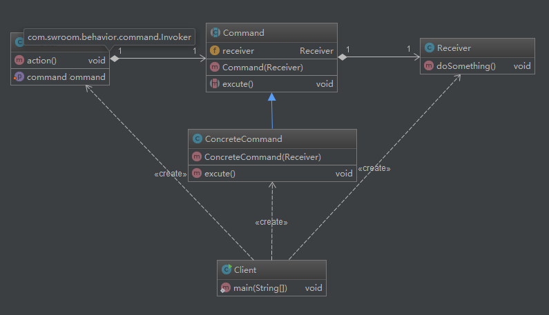

# 命令模式

## UML类图

## 定义
把命令封装起来，两边分别有调用者和接受者。调用者调用命令，接受者执行命令。

## 结构
* Command类：抽象类，需要对执行的命令进行声明，一般对外提供`excute`方法执行命令。
* ConcreteCommand类：Command实现类，对命令内部逻辑进行实现
* Client类：客户端调用类
* Invoker类：调用者，负责调用命令。
* Receiver类：接受者，负责接收命令并执行。

## 适用场景
对于大多数请求-响应模式的功能，比较适合使用命令模式，正如命令模式定义说的那样，命令模式对实现记录日志、撤销操作等功能比较方便。