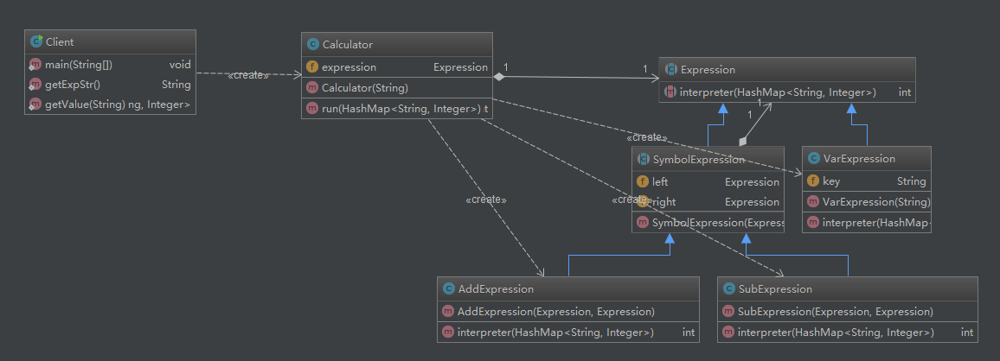

# 解释器模式

## UML类图

## 概述
解释器模式（Interpreter Pattern）是一种按照规定语法进行解析的方案。
 
* AbstractExpression 抽象解释器

* TerminalExpression终结符表达式
通常一个解释器模式中只有一个终结符表达式，但有多个实例。比如`a+b-c`中的`a`,`b`,`c`

* NonterminalExpression 非终结符表达式
非终结符表达式根据逻辑的复杂程度而增加，原则上每个文法规则都对应一个非终结符表达式。比如`a+b-c`中的`+`,`-`

* Context 环境角色

## 优点
解释器是一个简单语法分析工具，它最显著的优点就是扩展性，修改语法规则只要修改相应的非终结符表达式就可以了，若扩展语法，则只要增加非终结符类就可以了。

## 缺点
* 解释器模式会引起类膨胀
* 解释器模式采用递归调用方法
无论是面向过程的语言还是面向对象的语言，递归都是在必要条件下使用的，它导致调试非常复杂。
* 效率问题
解释器模式由于使用了大量的循环和递归，效率是个不容忽视的问题，特别是用于解析复杂、冗长的语法时，效率是难以忍受的。

## 适用场景
* 重复发生的问题可以使用解释器模式
* 一个简单语法需要解释的场景

## 注意事项
尽量不要在重要的模块中使用解释器模式，否则维护会是一个很大的问题。在项目中可以使用shell、JRuby、Groovy等脚本语言来代替解释器模式，弥补Java编译型语言的不足。若你确实遇到“一种特定类型的问题发生的频率足够高”的情况，准备使用解释器模式时，可以考虑一下Expression4J、MESP（Math Expression String Parser）、Jep等开源的解析工具包。