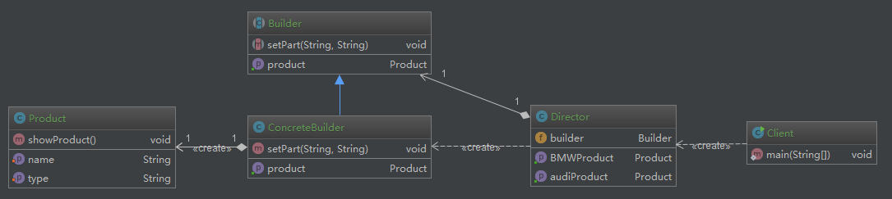

# 建造者模式

## UML类图

## 示例
有单独的产品类（POJO类），抽象建造者类，建造者实现类，导演类
其中，抽象建造者类，定义针对产品的创建与返回方法，建造类具体实现，导演类调用建造者生成不同的产品，上下文调用者调用导演类。

## 与工厂方法模式的区别
建造者模式和工厂方法模式非常相似，总体上就是在工厂模式上多了一个“导演类”。

一般来说，建造者模式适用于创建**更复杂的对象**。

工厂模式：工厂类负责对象的创建过程，由工厂向调用者提供产品。

建造者模式：建造者类只负责产品内部各组件的建造，而导演类负责将各组件装配，把变化的部分用导演类封装，这样工厂类就不用在每次扩展时更改。

## 总结
建造者模式与工厂模式类似，他们都是建造者模式，适用的场景也很相似。

一般来说，如果产品的建造**很复杂**，那么请用工厂模式；如果产品的建造**更复杂**，那么请用建造者模式。